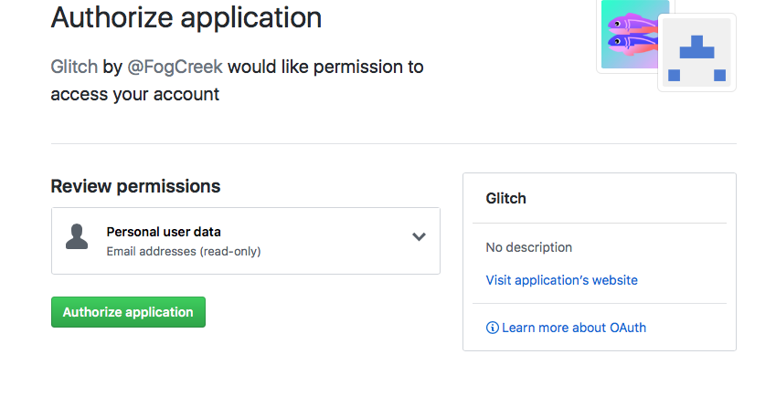
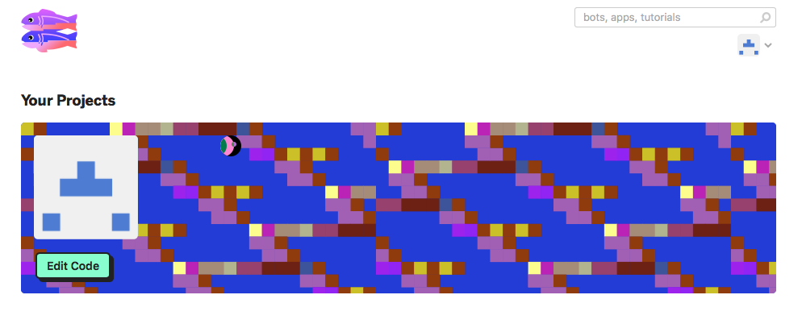
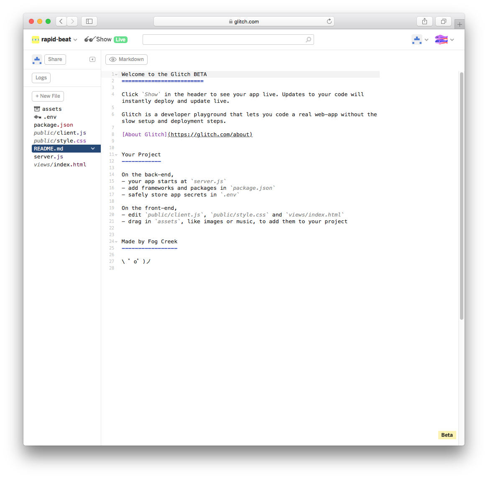
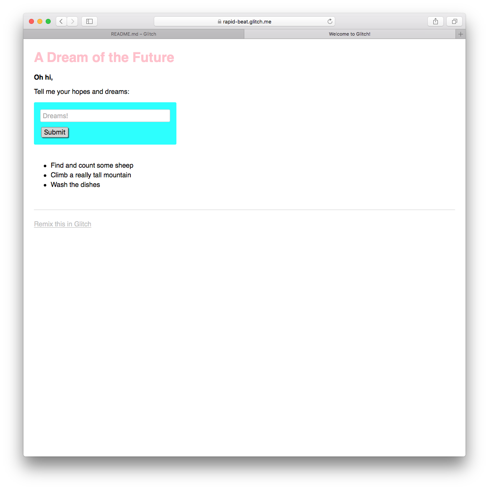

# Gomix Setup

If you do not have a github account, create one now:

- <https://github.com>

Now sign up for the gomix service:

- <https://glitch.com>

If you sign in - with your github account - Github will ask you to authorize the application:

You should then proceed to a dashboard:

Select 'Edit Code' and you will get to at starter project:

Press the `Show` button and it will reveal a live version of of the app you have just created:

You can interact with this repo by entering text in the Dreams box. Also, as this app is live in the cloud - and this is your own copy of the app - you can share this link with others. 

Do this now with someone also doing the lab - perhaps you can pair up with someone via the lab chat?

Verify that you each see different lists depending on what has been entered. Enter some 'dreams' into you someone else's app.
