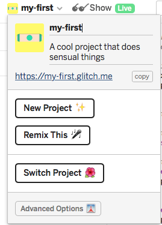
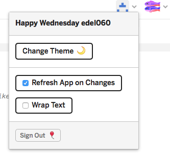
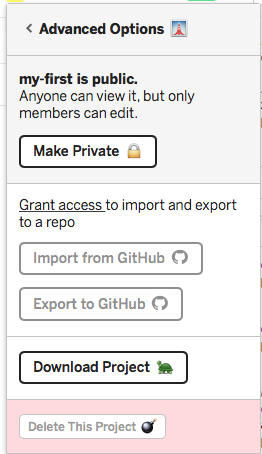

# Configuring the Project

The project name can be changed by directly entering a new name on the sidebar:

This will also change the project url, so if you have shared the app you will have to re-share the new url.

Another useful option is to disable the 'Refresh App on Changes' option:

Try this now. The behaviour of this feature can be a little confusing as the log may continue to report errors - but the live app itself will not be refreshed until you re enable the option.

Explore the advanced options:

Experiment with of all of these options.

For `Export to github`, the repository must already exist in your account. The project will, however, be on a different branch from master, so might not be visible at first unless you switch branches.