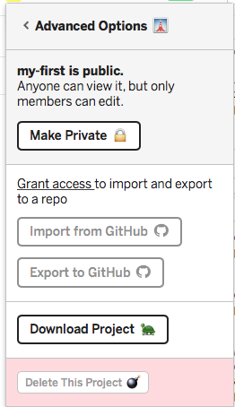

# Run Offline

On your workstation, install <https://nodejs.org> (select the latest LTS version).

In the `Advanced Options` in Glitch, select `Download Project`

- Edit the file `server.js`, changing the following statements:

~~~js
// listen for requests :)
var listener = app.listen(process.env.PORT, function () {
  console.log('Your app is listening on port ' + listener.address().port);
});
~~~

to:

~~~js
// listen for requests :)
const listener = app.listen(process.env.PORT || 4000, function () {
  console.log('Your app is listening on port ' + listener.address().port);
});
~~~

From a command shell, inside the project folder you just unarchived, run the following commands:

~~~bash
npm install
npm start
~~~

The latter command should display:

~~~
> my-glitch-app@0.0.1 start /Users/edeleastar/Downloads/app
> node server.js

Your app is listening on port 4000
~~~

If you open a browser now on <http://localhost:4000> your application should be running locally:

