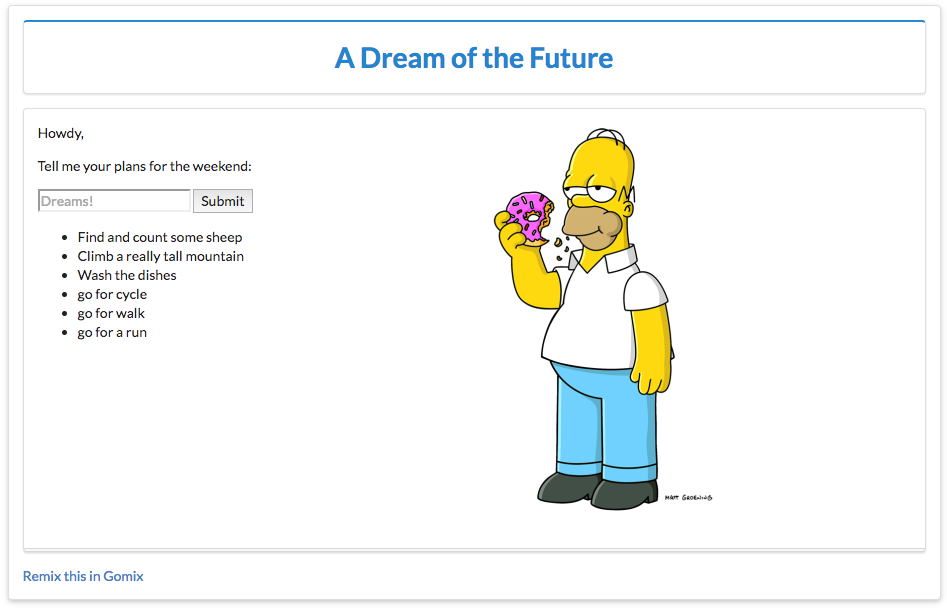

# Exercises

## Exercise 1: Semantic UI

Modify index.html to include the latest semantic ui libraries:

### Step 1:

include these extra elements in the `<head>` section of index:

~~~html

<link rel="stylesheet" href="https://cdnjs.cloudflare.com/ajax/libs/semantic-ui/2.2.6/semantic.min.css" type="text/css">

~~~

### Step 2:

Examine this view:

Try to modify index.html to render as above using semantic ui `container`, `segment`, `header` and `form` classes.

## Exercise 2:

See if you can incorporate an image into the page:

This will require you to:

- locate and upload an image by dragging it to the `assets` folder.
- click on the image to acquire the image `url`
- insert an `` tag with this url into index.

## Exercise 3:

If you completed the above tasks, download the the app again and run it locally (see step 4).
