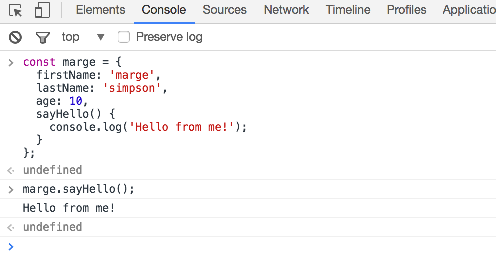
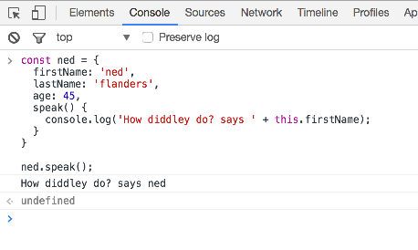

# Objects with Functions

Try this object in the console:

~~~
const marge = {
  firstName: 'marge',
  lastName: 'simpson',
  age: 10,
  sayHello() {
    console.log('Hello from me!');
  }
};
~~~

This has different type of attribute - a function:

~~~
  sayHello() {
    console.log('Hello from me!');
  }
~~~

We can log the object as before:

~~~
console.log(marge);
~~~

We can also call the function we have just defined:

~~~
marge.sayHello();
~~~

Your console might look like this:

## this

Try this new object in the console:

~~~
const ned = {
  firstName: 'ned',
  lastName: 'flanders',
  age: 45,
  speak() {
    console.log('How diddley do? says ' + this.firstName);
  }
}

ned.speak();
~~~

Note the difference in the function:

~~~
  speak() {
    console.log('How diddley do?' + this.firstName);
  }
~~~

Here we are using `this` to access the firstName attribute of the ned object.

# Exercises

Use `simpsons.js` (not the console) for this exercise.

## Exercise 1: Objects with Functions

Create another Simpsons character of your choice. Include a hello() function, and have the function say something relevant to the character. Also include a goodby() function which says something else. Once you have created the objects, call them functions a few times.

