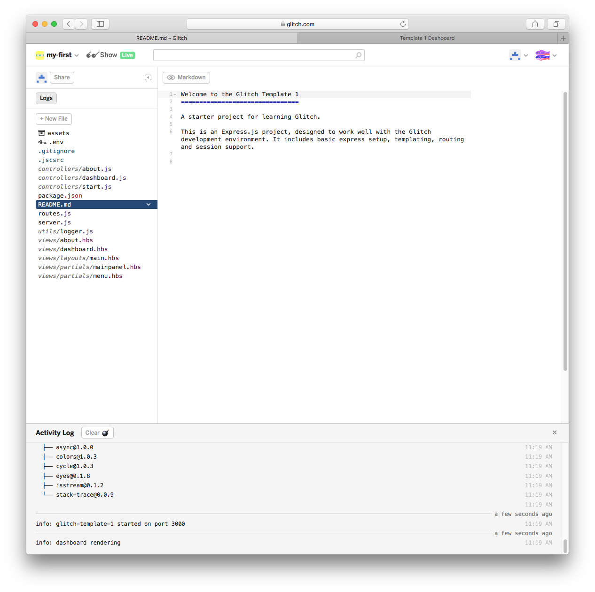

# Template 1

Create a new project in gomix - this will be a replica of the project created at the start of the last lab. Rename the project to your preference.

Trun on the logs viewer, and then import a project from github:

Enter `edeleastar/gomix-template-1` as shown. This will replace your project completely:

Run the app and explore the (small) number of views:

