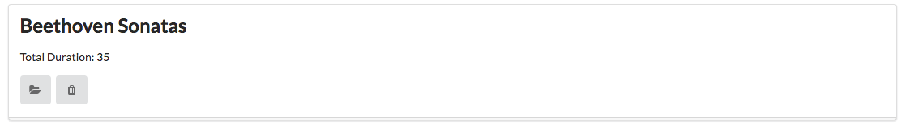

# Exercises

If you want to download a complete version of the app as it should be at the end of this lab, then create a new Gomix project, and import `edeleastar/gomix-playlist-2`.

## Exercise 1: UX Enhancements

Introduce a 'Delete Playlist' button for each playlist, represented by a `trash` icon. E.g:

In addition, the `view` link is replace by a `folder open` icon.

Bind the `delete playlist` button to a new function to be implemented in the Dashboard controller, which should log the id of the playlist to be deleted.

## Exercise 2: Delete Playlist Functionality

Make the button actually delete the denoted playlist.

HINT: This is a new function in the `playlist-store` module to delete a playlist, given an ID:

~~~js
removePlaylist(id) {
  _.remove(this.playlistCollection, { id: id });
},
~~~

Try to implement the rest of the feature, using the song delete feature as a guide.

## Exercise 3: listplaylists partial

This is the current `dashoard.hbs` partial:

~~~html
{{> menu id="dashboard"}}

{{#each playlists}}
  <section class="ui segment">
    <h2 class="ui header">
      {{title}}
    </h2>
    
 Total Duration: {{duration}} 

    <a href="/playlist/{{id}}" class="ui icon button">
      <i class="icon folder open"></i>
    </a>
    <a href="/dashboard/deleteplaylist/{{id}}" class="ui icon button">
      <i class="icon trash"></i>
    </a>
  </section>
{{/each}}
~~~

Replace the above with this version:

~~~html
{{> menu id="dashboard"}}

<section class="ui segment">
  {{> listplaylists}}
</section>
~~~

This requires you to write a new partial called `listplaylists`.

Here is how the dashboard should look when complete:

