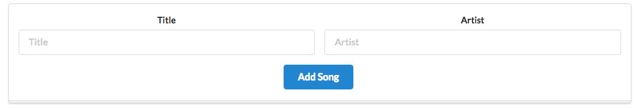

# Adding a Song

Before adding a song, lets align the delete button appearance with the delete playlist. Use this icon button instead of the existing one:

~~~html
<a href="/playlist/{{../playlist.id}}/deletesong/{{id}}" class="ui icon button">
  <i class="icon trash"></i>
</a>
~~~

In order to add songs, we need this new partial which provides a simple add song form:

## views/partials/addsong.hbs

~~~html
<form class="ui stacked segment form" action="/playlist/{{playlist.id}}/addsong" method="POST">
  

    

      <label>Title</label>
      <input placeholder="Title" type="text" name="title">
    

    

      <label>Artist</label>
      <input placeholder="Artist" type="text" name="artist">
    

  

  <button class="ui blue submit button">Add Song</button>
</form>
~~~

Then we need to include this in the playlist view:

## views/playlist.hbs

~~~
{{> menu}}

<section class="ui center aligned middle aligned segment">
  <h2 class="ui header">
    {{playlist.title}}
  </h2>
  {{> listsongs}}
  {{> addsong}}
</section>~~~

This should now appear:

This requires a new route to support the `POST` action:

## routes.js

~~~js
router.post('/playlist/:id/addsong', playlist.addSong);
~~~

... and this new function in the `playlist` controller:

## controllers/playlist.js

~~~js
...
  addSong(request, response) {
    const playlistId = request.params.id;
    const playlist = playlistStore.getPlaylist(playlistId);
    const newSong = {
      title: request.body.title,
      artist: request.body.artist,
    };
    playlistStore.addSong(playlistId, newSong);
    response.redirect('/playlist/' + playlistId);
  },
...
~~~

This is the implementation of the `addSong` method in the store:

## modiels/playlist-store.js

~~~js
  addSong(id, song) {
    const playlist = this.getPlaylist(id);
    playlist.songs.push(song);
  },
~~~

Try this now and verify that you can add songs.

Can you delete one of the songs you have just added? Can you delete one of the songs that have been in there already? Can you explain what is going wrong?
