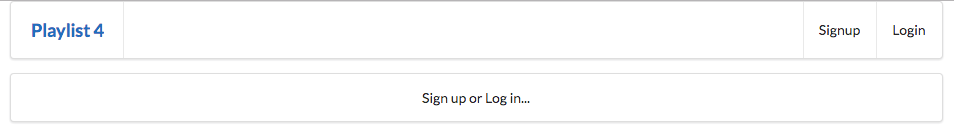

# Routes

These new views+ controller  all require new routes:

## routes.js

In particular, these specific routes:

~~~

...
const accounts = require('./controllers/accounts.js');
...

...
router.get('/', accounts.index);
router.get('/login', accounts.login);
router.get('/signup', accounts.signup);
router.get('/logout', accounts.logout);
router.post('/register', accounts.register);
router.post('/authenticate', accounts.authenticate);
...
~~~

This is the complete revised routes.js

~~~
'use strict';

const express = require('express');
const router = express.Router();

const dashboard = require('./controllers/dashboard.js');
const about = require('./controllers/about.js');
const playlist = require('./controllers/playlist.js');

router.get('/', accounts.index);
router.get('/login', accounts.login);
router.get('/signup', accounts.signup);
router.get('/logout', accounts.logout);
router.post('/register', accounts.register);
router.post('/authenticate', accounts.authenticate);

router.get('/dashboard', dashboard.index);
router.get('/dashboard/deleteplaylist/:id', dashboard.deletePlaylist);
router.post('/dashboard/addplaylist', dashboard.addPlaylist);

router.get('/about', about.index);
router.get('/playlist/:id', playlist.index);
router.get('/playlist/:id/deletesong/:songid', playlist.deleteSong);
router.post('/playlist/:id/addsong', playlist.addSong);

module.exports = router;
~~~

The application should be running now. You should see these new views:

### A new landing page

### Signup

### login

