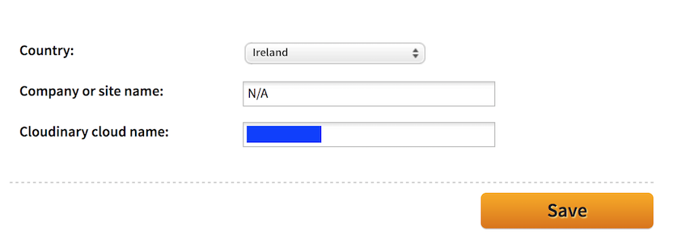
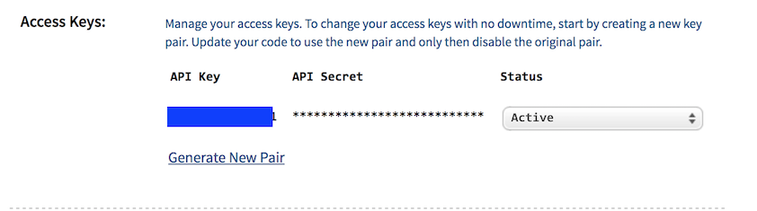

# Signup

Visit this site:

- <http://cloudinary.com/>

and and sign up for a free account - on the free plan. Be sure to verify your email address, as your account will be suspended if it is not confirmed within a day or so.

During sign up, you will be offered a 'Cloudinary cloud name' - you can accept the default one or try to claim one.

When you are logged in visit the 'Settings' screen. You Cloudinary name will be viable on the 'Account' screen:

On the 'Security' panel, scroll the end and take note of the `Access Keys' (blacked out here):

The `API Secret' normally displays as asterisks. If you click on them, the actual code will be revealed. 

