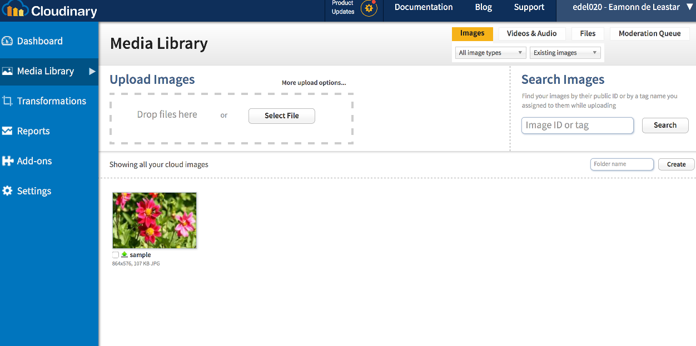

# Exploring Cloudinary

Visit the Media Library page:

Experiment with uploading a picture by draging and dropping an image to the upload area.

Once uploaded, double click on the image and look at the various options:

Note the url on the bottom right - this is a public url for the uploaded image. If you click on it, it will load.  You can share this link publicly.