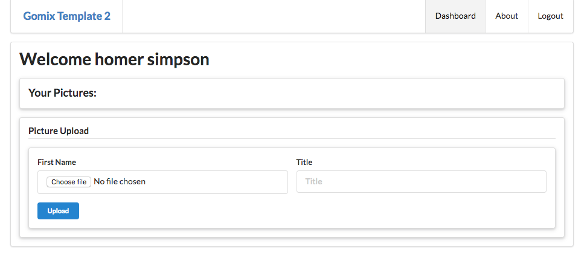

# Dashboard

Here is a replacement for the Dashboard view:

## views/dashboard.hbs

~~~
{{> menu id="dashboard"}}

<section class="ui segment">
  <h1 class="ui header">
    Welcome {{user.firstName}} {{user.lastName}}
  </h1>

  <section class="ui raised segment">
    <h1 class="ui header">
      Your Pictures:
    </h1>
  </section>

  <section class="ui raised segment">
    
 Picture Upload 

    <section class="ui raised form segment">
      <form action="/dashboard/uploadpicture" method="post" enctype="multipart/form-data">
        

          

            <label>First Name</label>
            <input type="file" name="picture">  </input>
          

          

            <label>Title</label>
            <input placeholder="Title" type="text" name="title">
          

        

        <button class="ui mini blue submit button"> Upload </button>
      </form>
    </section>
  </section>

</section>
~~~

The dahboard should look like this:

The UI for uploading a picture should work - try to upload one now. When you press the 'upload' button you will get this:

~~~
Cannot POST /dashboard/uploadpicture
~~~

This is because the form action route is not yet implemented:

~~~
...
      <form action="/dashboard/uploadpicture" method="post" enctype="multipart/form-data">
...
~~~