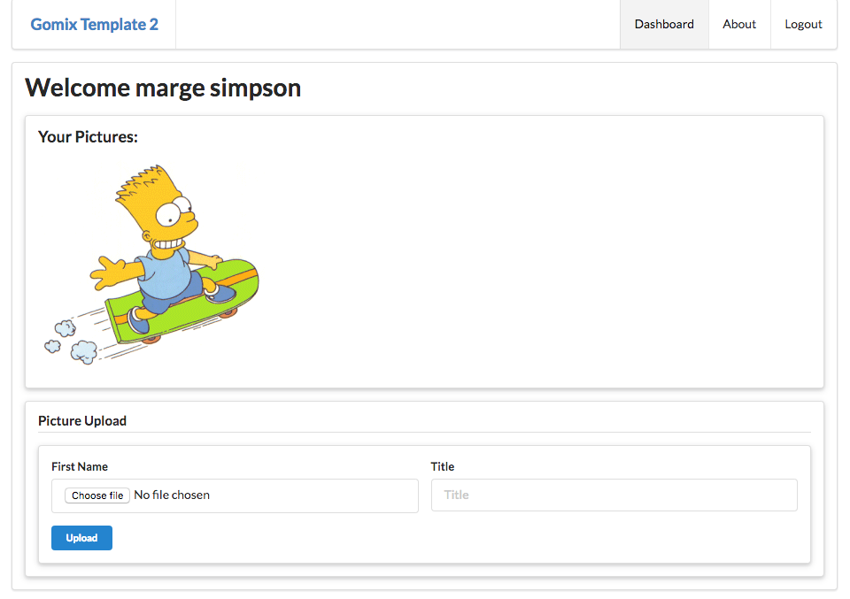
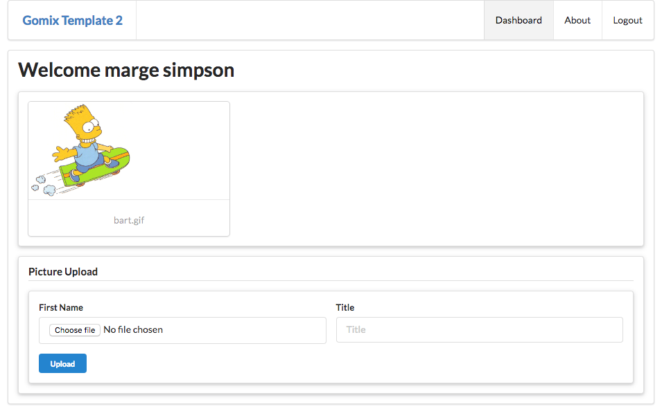
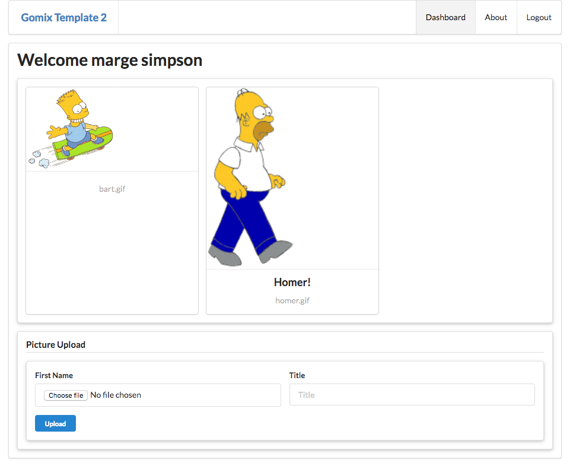

# Displaying Pictures

To Display the pictures, replace the pictures segment on daashboard with this:

~~~
...
  <section class="ui raised segment">
    <h3 class="ui header">
      Your Pictures:
    </h3>
    {{#each album.pictures}}
      
    {{/each}}
  </section>
...
~~~

When you log in now again, and if you upload some pictures, they will appear on the dashboard.

# Cards

We could improve the layout by bringing in the following partial:

## views/partials/card.hbs

~~~

  

    
  

  

    
{{title}}

    

      {{file}}
    

  

~~~

... and we can replace the picture segment on the dashboad with this:

## views/dashboard.hbs

~~~
...
  <section class="ui raised segment">
    

    {{#each album.pictures}}
      {{> card }}
    {{/each}}
    

  </section>
...
~~~

Try it now:

If we add a title to the picture when we upload, it should appear in the card:

