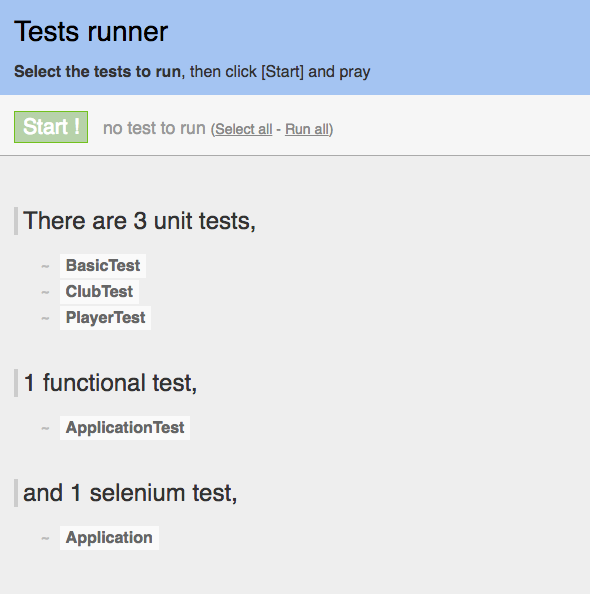
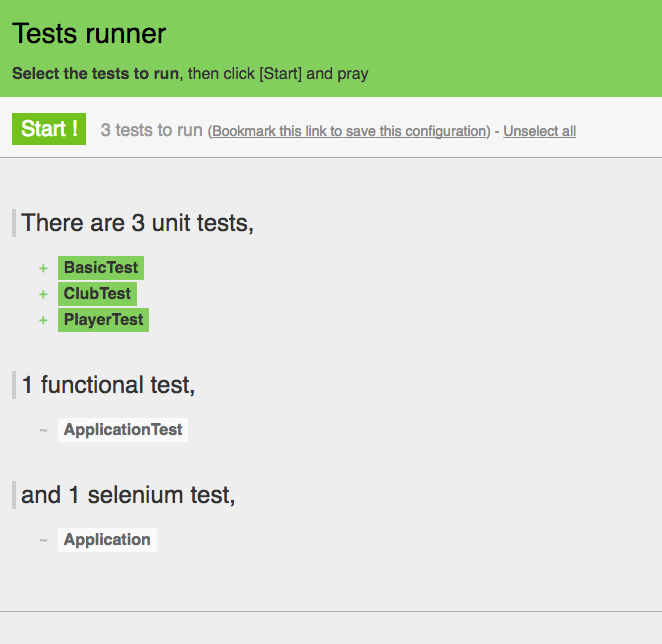

#JPA Model Project

Create a brand new Play project. Do this by navigating to the correct folder folder (most likely your workspace) and running a command prompt. Then type:

~~~
play new jpamodel
~~~

Once this has completed, change into the folder just created (jpamodel) and run the eclipsify command:

~~~
cd jpamodel
play eclipsify
~~~

You can now import the project into eclipse in the usual way.

If you are using Idea, then the command is different:
~~~
cd jpamodel
play idealize
~~~

Once imported, you may need to make sure the project is configured for an in-memory database - by verifying that `conf/application.conf` contains the following:

~~~
db.default=mem
~~~

##Initial Model for Player and Club

In your jpamodel eclipse project, create two new classes in the model package:

##Club

~~~java
package models;

import javax.persistence.Entity;
import play.db.jpa.Model;

@Entity
public class Club extends Model
{
  public String name;

  public Club(String name)
  {
    this.name = name;
  }
}
~~~

##Player

~~~java
package models;

import javax.persistence.Entity;
import play.db.jpa.Model;

@Entity
public class Player extends Model
{
  public String name;

  public Player(String name)
  {
    this.name = name;
  }
}
~~~

Now we create the unit test harnesses. This is similiar to the Junit tests you have been running in Java project, except this time the unit tests are bound into the web an database application. 

To do this, in 'test/default package' create these two classes:

##ClubTest

~~~java
import org.junit.*;

import java.util.*;
import play.test.*;
import models.*;

public class ClubTest extends UnitTest 
{
  @Before
  public void setup()
  {
  }
  
  @After
  public void teardown()
  {
  }

  @Test
  public void testCreate()
  {
    
  }
}
~~~

##PlayerTest

~~~java
import org.junit.*;

import java.util.*;
import play.test.*;
import models.*;

public class PlayerTest extends UnitTest 
{
  @Before
  public void setup()
  {
  }
  
  @After
  public void teardown()
  {
  }

  @Test
  public void testCreate()
  {
    
  }
}
~~~

Run the app now in 'test' mode:

~~~
play test
~~~

...and navigate to the test runner page:

- <http://localhost:9000/@tests>

This will look like this initially:

Select the Club and Player tests - and then press 'Start!':

and they should be green. The tests are empty - but we have just verified that the test harness is functioning correctly.

Also try the database interface:

- <http://localhost:9000/@db>

