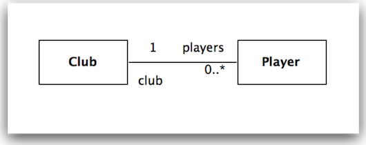
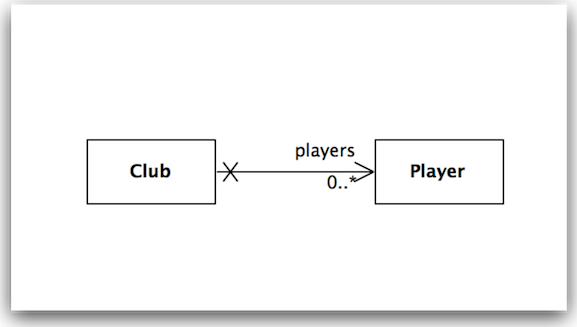

##Bidirectional Club / Player Relationship

We might like each player to also 'know' which club he/she belongs to. In fact this is probably a more natural relationship for these model elements:

Contrast this with the earlier version:

Implementing this variant of the relationship requires additional attributes and annotations in both Player and Club.

##Player:

~~~java
...
import javax.persistence.ManyToOne;
...

  @ManyToOne
  public Club club;
~~~

##Club

~~~
  @OneToMany(mappedBy="club", cascade=CascadeType.ALL)
  public List<Player> players;
~~~

The name 'club' must match in both the annotation and the attribute. We also need to make the following adjustment to the Club.addPlayer method:

~~~java
  public void addPlayer(Player player)
  {
    player.club = this;
    players.add(player);
  }
~~~

This method ensures that the relationship is correctly established.

No adjustment to the model can be considered complete without a unit test. Introduce the following test to ClubTest:

~~~java
  @Test
  public void testPlayerClub()
  {
    Player mike  = Player.findByName("mike");
    assertNotNull (mike.club);
    assertEquals ("tramore", mike.club.name);
  }
~~~

Whenever you change the model you should restart the application. Do this now and make sure this passes.

