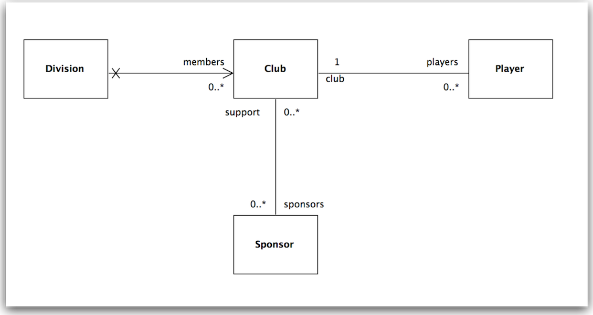

#Division + Sponsor

We would now like to extend the model to include the following extra classes:

These are the new classes for Division & Sponsor:

##Division.java

~~~java
package models;

import java.util.ArrayList;
import java.util.HashSet;
import java.util.List;
import java.util.Set;

import javax.persistence.CascadeType;
import javax.persistence.Entity;
import javax.persistence.OneToMany;

import play.db.jpa.Model;

@Entity
public class Division extends Model
{
  public String name;
  
  @OneToMany(cascade=CascadeType.ALL)
  public List<Club> members;
  
  public Division(String name)
  {
    this.name = name;
    members = new ArrayList<Club>();
  } 
  
  public void addClub(Club club)
  {
    members.add(club);
  }
  
  public String toString()
  {
    return name;
  }
  
  public static Division findByName(String name)
  {
    return find("name", name).first();
  }
}
~~~

##Sponsor.java

~~~java
package models;

import java.util.ArrayList;
import java.util.HashSet;
import java.util.List;
import java.util.Set;

import javax.persistence.Entity;
import javax.persistence.JoinTable;
import javax.persistence.ManyToMany;

import play.db.jpa.Model;

@Entity
public class Sponsor extends Model
{
  public String name;
  
  @ManyToMany (mappedBy="sponsors")
  public List<Club> support;
  
  public Sponsor(String name)
  {
    this.name = name;
    support = new ArrayList<Club>();
  }
  
  public void addSuport(Club club)
  {
    support.add(club);
  }
  
  public String toString()
  {
    return name;
  }
}
~~~

+ some modifications to Club:

##Club.java

~~~java

  //...
  @ManyToMany
  public List<Sponsor> sponsors;
  //...

  public Club(String name)
  {
    this.name = name;
    this.players = new ArrayList<Player>();
    this.sponsors = new ArrayList<Sponsor>();
  }
  
  public void addSponsor(Sponsor company)
  {
    sponsors.add(company);  
  }

~~~

